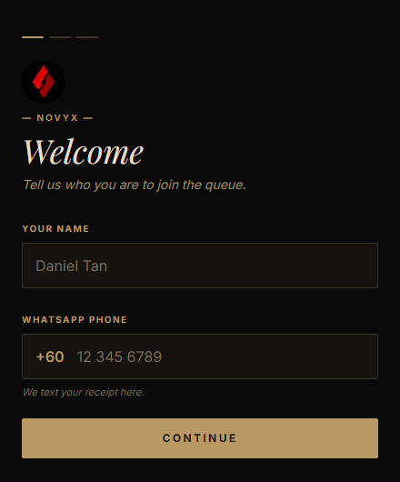
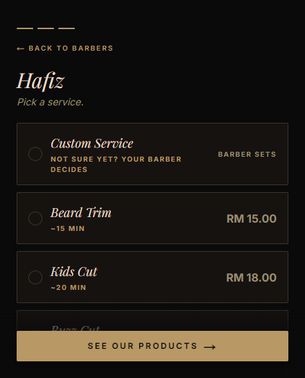
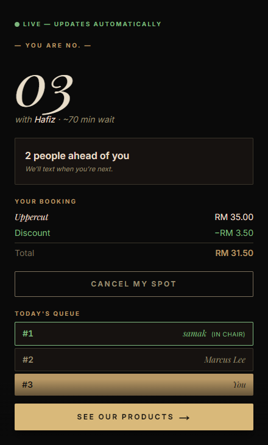
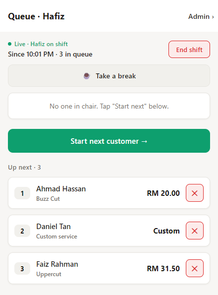
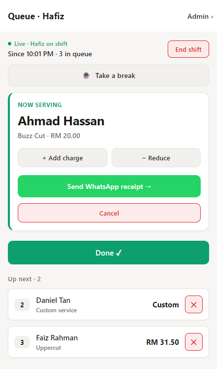
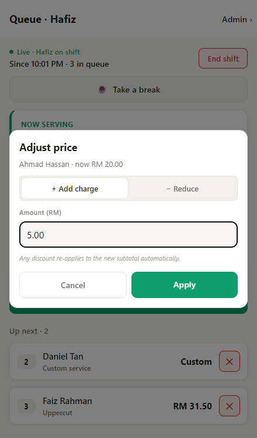
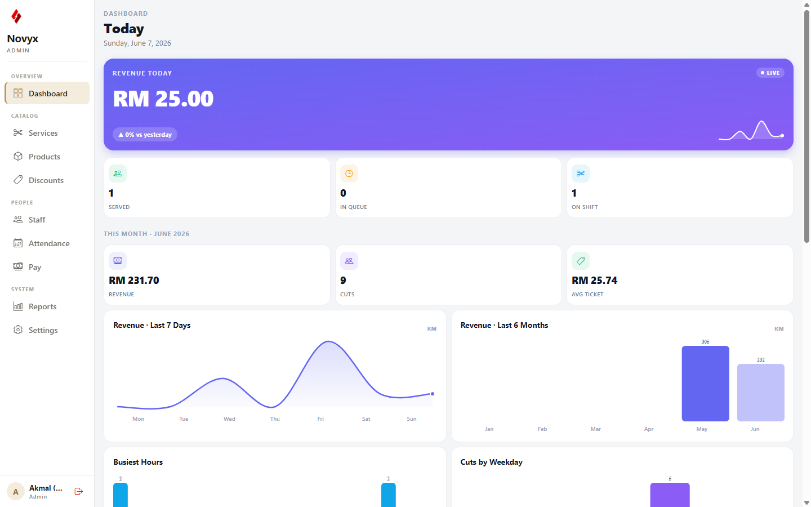
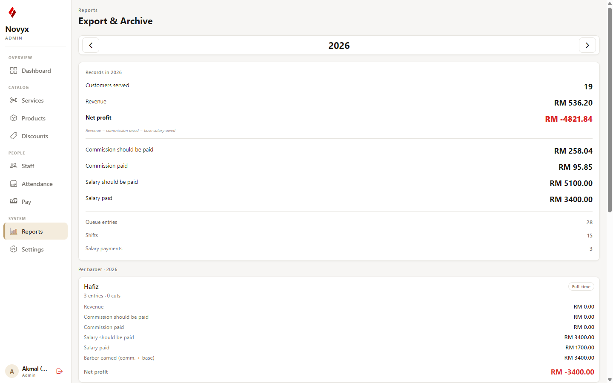
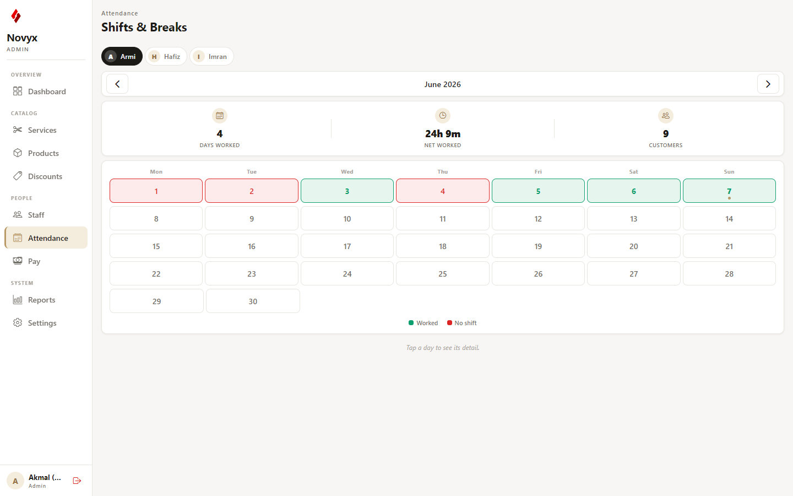
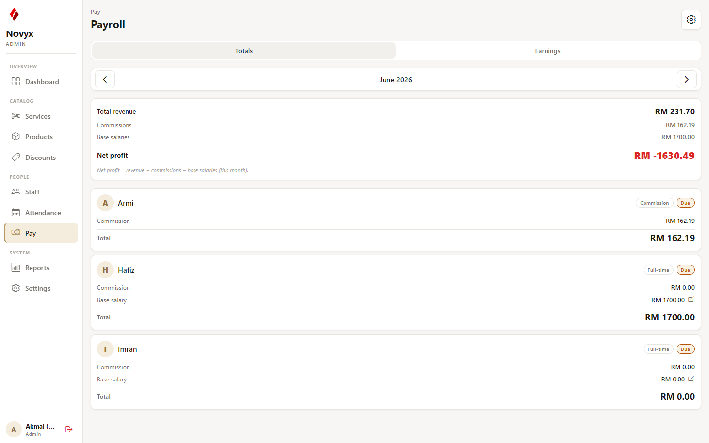

<div align="center">


# Novyx — Barbershop Queue & Booking System

**A production system running daily in a real barbershop in Malaysia.**

Customers scan a QR code to join the queue from their phone. Barbers run the chair from a tablet. The owner manages the whole shop — staff, pricing, payroll, and analytics — from an admin console.

Built end to end: customer web app, staff/admin app, and the Postgres backend behind them.


</div>

---

> **Note** — This repository is shared as a portfolio piece to show my work. The code powers a live business and is **not** licensed for reuse or redistribution. Secrets, environment files, and the production database are not part of this repo.

---

## What it does

The shop has no appointments — it's walk-in. The hard part is the **queue**: who's next, for which barber, at what price, and keeping three different screens in sync in real time.

| Surface | Who | Tech | What they do |
|---|---|---|---|
| **Customer site** | Walk-in customers | Next.js 15 (web) | Scan QR → enter name + WhatsApp → pick a barber & service → watch their live position in the queue |
| **Barber view** | Barbers, on a shared tablet | Expo / React Native | Clock in, advance the queue, adjust prices, take breaks, send WhatsApp receipts |
| **Admin console** | Owner | Expo / React Native | Services, products, discounts, staff, attendance, payroll, and an analytics dashboard |

---

## Screenshots

### Customer — join the queue from your phone

<table>
<tr>
<td width="33%"></td>
<td width="33%"></td>
<td width="33%"></td>
</tr>
<tr>
<td align="center"><sub>Identify yourself</sub></td>
<td align="center"><sub>Pick barber & service</sub></td>
<td align="center"><sub>Live position — updates in real time</sub></td>
</tr>
</table>

### Barber — run the chair from a tablet

<table>
<tr>
<td width="33%"></td>
<td width="33%"></td>
<td width="33%"></td>
</tr>
<tr>
<td align="center"><sub>The queue, per barber</sub></td>
<td align="center"><sub>Now serving + WhatsApp receipt</sub></td>
<td align="center"><sub>Per-cut price adjustments</sub></td>
</tr>
</table>

### Admin — manage the whole shop

<table>
<tr>
<td width="50%"></td>
<td width="50%"></td>
</tr>
<tr>
<td align="center"><sub>Analytics dashboard — revenue trends, busiest hours, cuts by weekday</sub></td>
<td align="center"><sub>Payroll & year-end export — commission vs. salary, per barber</sub></td>
</tr>
<tr>
<td width="50%"></td>
<td width="50%"></td>
</tr>
<tr>
<td align="center"><sub>Attendance & breaks</sub></td>
<td align="center"><sub>Per-barber salary + commission</sub></td>
</tr>
</table>

---

## Architecture

```
                 ┌──────────────────────┐
   QR code  ───► │  Customer web (web/) │  Next.js 15 · React 19 · Tailwind
                 │  join queue, live    │  deployed on Vercel
                 │  status              │
                 └───────────┬──────────┘
                             │
                  Supabase Realtime + RLS
                             │
                 ┌───────────┴──────────┐        ┌──────────────────────┐
                 │   Supabase backend   │◄──────►│  Staff/Admin (app/)  │
                 │  Postgres · Auth ·   │        │  Expo / React Native │
                 │  Realtime · 24 SQL   │        │  installed as a PWA  │
                 │  migrations · RLS ·  │        │  on the shop tablet  │
                 │  SECURITY DEFINER    │        └──────────────────────┘
                 │  RPCs                │
                 └──────────────────────┘
                             ▲
                  shared/ — TypeScript types
                  shared by web + app
```

- **`web/`** — customer-facing Next.js 15 (App Router) site.
- **`app/`** — Expo / React Native staff + admin app. Same binary serves the barber view and the admin console; admin is gated behind auth.
- **`supabase/`** — the database: schema, RPC functions, RLS policies, and **24 incremental migrations**.
- **`shared/`** — TypeScript types and money/phone helpers imported by both clients, so the contract can't drift.

---

## Engineering highlights

The things I'd actually want to talk through in an interview:

- **Real-time queue across three screens.** The customer's live position, the barber's chair, and the admin dashboard all stay in sync over Supabase Realtime — no polling, no refresh button.

- **A security model built for a shared tablet.** Barbers don't have individual logins — they operate in an **anonymous staff mode** on a shared device, while admin is the only authenticated role. Every table has **Row-Level Security**; destructive operations run through **`SECURITY DEFINER` RPCs** gated by a shared **operator-secret header**, so the public anon key can't be used to wipe or exfiltrate data. Customer phone numbers (PII) aren't even readable over the API — they're fetched one entry at a time through an operator-gated function only when a receipt is sent.

- **Money is never a float.** All amounts are stored as integer **sen** (RM cents) and formatted only at the edge — no rounding drift in revenue or payroll.

- **A global mock/live backend switch.** The owner can flip the *entire* app between a demo database and the live database with a typed-confirmation guard, so staff can be trained and features demoed without ever touching real customer data.

- **WhatsApp receipts at zero API cost.** Receipts open a pre-filled `wa.me` chat instead of paying for the WhatsApp Business API. On Android tablets the link is routed via an `intent://` URL straight to the **WhatsApp Business** app (`com.whatsapp.w4b`), with a graceful fallback when it isn't installed.

- **Shipped as a PWA to dodge platform fees.** The staff/admin app installs to the shop tablet as a Progressive Web App (Add to Home Screen) instead of a native store build — no $99/yr Apple fee, instant updates on deploy.

- **Payroll & analytics, not just a queue.** Per-barber salary + commission, attendance and break tracking, a charts dashboard (revenue trends, busiest hours, cuts by weekday), and a year-end archive/export.

- **24 incremental SQL migrations.** The schema evolved feature by feature — products, payroll, breaks, security hardening, the backend toggle — each as a self-contained, reviewable migration rather than one big dump.

---

## Tech stack

| Layer | Tech |
|---|---|
| Customer web | Next.js 15 (App Router), React 19, Tailwind CSS |
| Staff / admin app | Expo SDK 51+, React Native, expo-router |
| Backend | Supabase — Postgres, Auth, Realtime, Row-Level Security |
| Shared code | TypeScript types + helpers shared across both clients |
| Messaging | `wa.me` click-to-chat + Android `intent://` routing to WhatsApp Business |
| Hosting | Vercel (web + app PWA) |

---

## Repo layout

```
├── web/         Customer-facing Next.js site
├── app/         Expo / React Native staff + admin app
├── supabase/    Schema, RPC functions, RLS policies, 24 migrations
├── shared/      TypeScript types + money/phone helpers (shared by web & app)
└── docs/        Admin / barber / customer user manuals (PDF + screenshots)
```

The shop's three end-user manuals (admin, barber, customer) live under [`docs/`](docs/) as polished PDFs — written and illustrated as part of the handoff to the client.

<details>
<summary><strong>Running locally</strong> (for reference — requires your own Supabase project & secrets)</summary>

This is a live client system; the production environment files and database are not included. To stand up your own instance you'd create a Supabase project, apply the migrations in `supabase/migrations/` in order, seed it, bootstrap an admin user, then run each app per its README:

- [`web/README.md`](web/README.md)
- [`app/README.md`](app/README.md)

</details>

---

<div align="center">
<sub>Designed, built, and deployed by Akmal Nazmi · in production at a barbershop in Malaysia</sub>
</div>
